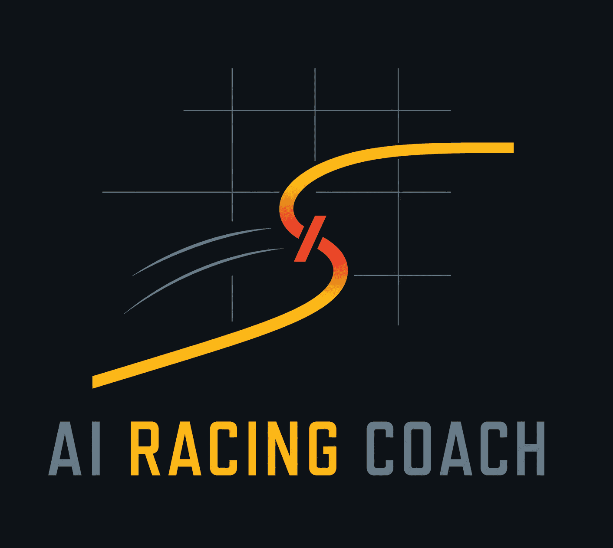
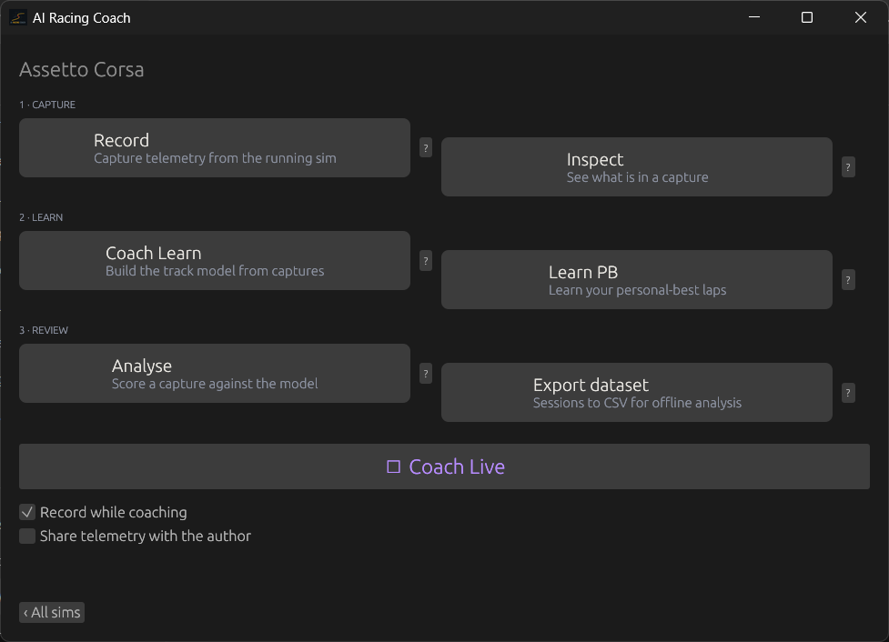
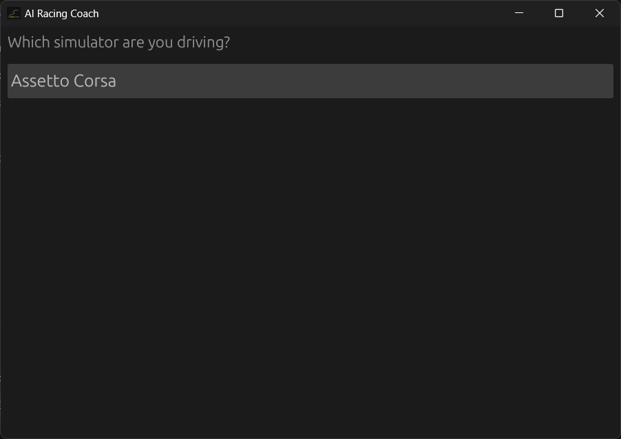
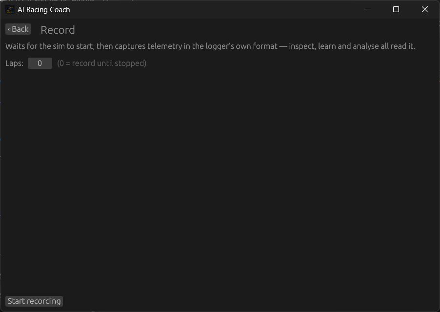
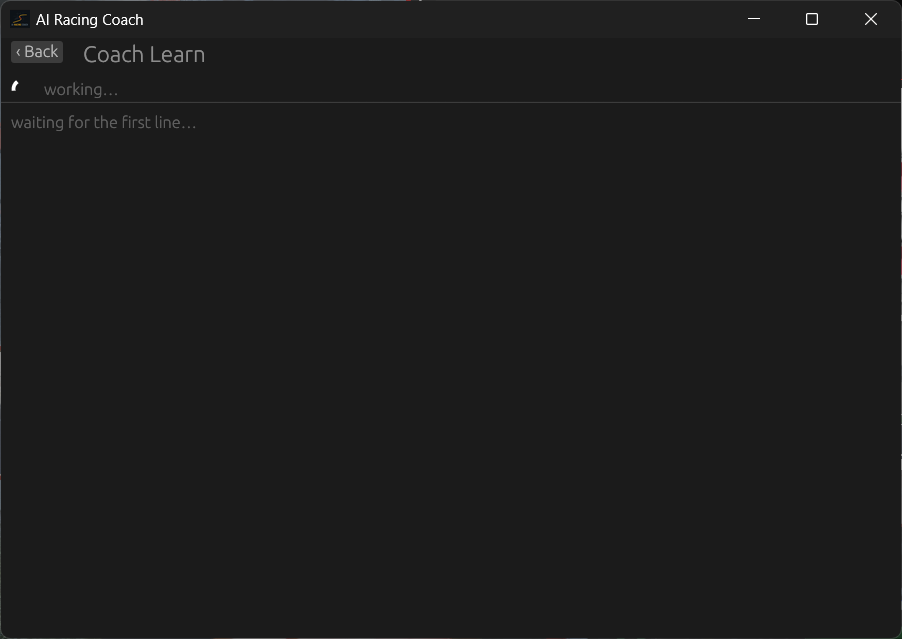
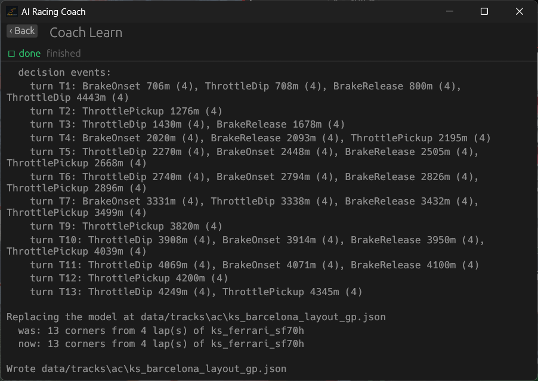
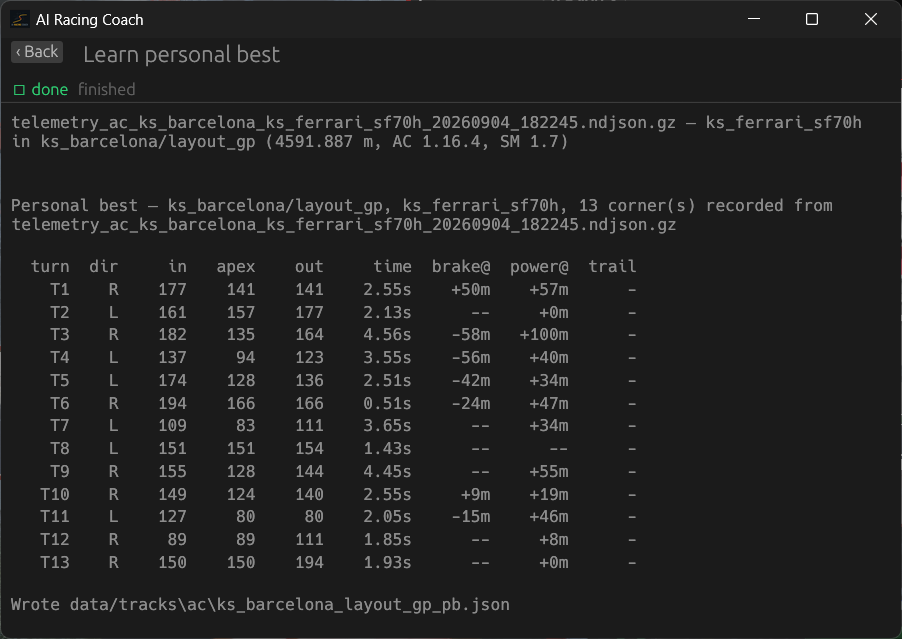
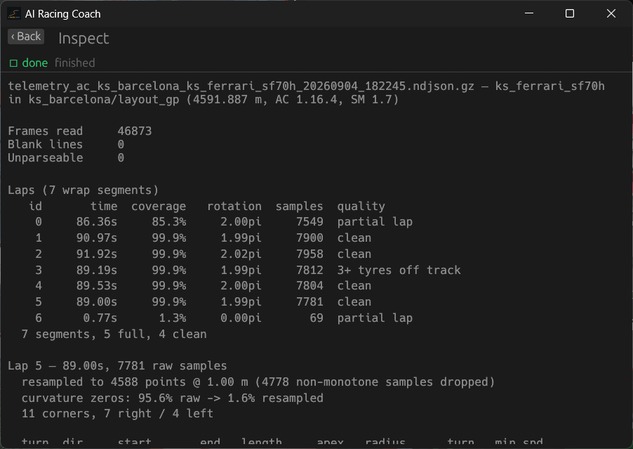
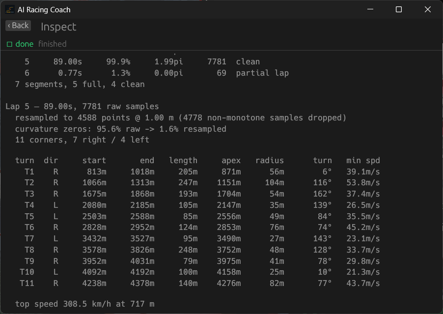

<p align="center">
  
</p>

# AI Racing Coach for Assetto Corsa

**An offline race engineer that learns your track, coaches you by voice, and measures every lap.**

Free. Open source (MIT). Runs entirely on your machine.

<p align="center">
  <video src="assets/ai_racing_coach_assets/assetto_corsa_ai_racing_coach_showcase.mp4" width="640" controls preload="metadata">
    Your browser does not support the video tag —
    <a href="assets/ai_racing_coach_assets/assetto_corsa_ai_racing_coach_showcase.mp4">download the showcase</a>.
  </video>
</p>

## Beta Testers Wanted

The current coach is rule-based — decent, but not smart. The next version learns from real telemetry, and that's where you come in: **drive with the coach, and (optionally) share your corner data to help train it.**

Every lap helps — different tracks, different cars, different driving styles. Different *bad* habits especially. If you can drive a few clean laps and click one button, you can contribute.

## Get Started

Setup takes about 30 seconds — no accounts, no installer, no configuration:

1. Download the latest release for your platform from the [Releases page](https://github.com/Wealth1000/ai_racing_coach/releases):
   - **Windows** (`coach-x.y.z-x86_64-pc-windows-msvc.exe`) — one step: download and double-click. Running the exe opens the coach's menu — that's the full experience, record straight from the running sim and get live coaching
   - **Linux** (`coach-x.y.z-x86_64-unknown-linux-gnu.tar.gz`) — unpack it (`tar -xzf`) for analysis and replay coaching from capture files
2. That's it — the coach's menu opens

### Your first session

The coach learns your track before coaching you on it, and the GUI walks you through it — no instructions needed. Launch the coach (double-click the exe, or `coach gui` for the same thing), pick your simulator from the menu:

<p>
  
  &nbsp;
  
</p>

…then follow the three steps the GUI gives you:

1. **Record** — drive a few clean laps in Assetto Corsa while the coach captures telemetry straight from the running sim

   

2. **Learn** — the coach builds a model of the track's corners and learns your personal best per corner

   <p>
     
     &nbsp;
     
   </p>

   

3. **Drive** — get live voice coaching as you drive (that's the video up top)

Every session is kept, and you can go back through any of it:

<p>
  
  &nbsp;
  
</p>

Voice works out of the box on Windows (it uses the voices that ship with Windows 10/11). On Linux it uses speech-dispatcher; `--voice null` runs a session silently.

## What It Does

Every time you hit the track:

- **Learns your corners** — from *your* clean laps. Any track, including community tracks — no built-in track database.
- **Coaches you live** — voice feedback the moment you finish a corner ("brake later into T3"). Advice is perishable: if the voice is busy, the line is skipped — never queued behind a stale sentence.
- **Compares to your best** — your fastest clean pass per corner is the reference. Advice argues in deltas against *your* personal best, not someone else's.
- **Records everything** — every live session is written to disk locally, and exportable as a flat CSV dataset.

## Privacy: Nothing Leaves Your Machine Unless You Say So

No accounts. No cloud. No analytics, no crash reporting, no telemetry beacon — the coach makes no network requests at all by default.

The only network feature is an **opt-in** "Send to author" button that shares a scrubbed corner-summary table to help train the smarter model. Consent is off by default, gated by a dialog that says exactly what's sent, and can be withdrawn at any time. Your name, player ID, hardware, settings, and raw captures never leave your machine.

Full details — every field kept and scrubbed: [PRIVACY.md](PRIVACY.md).

## FAQ

**Q: Does it work on custom tracks?**
A: Yes — corners are learned from your laps, not a built-in database. Tracks with clear, distinct corners work best; vague transitions are harder. If detection struggles on a track, that's exactly the feedback we need — [open an issue](https://github.com/Wealth1000/ai_racing_coach/issues) with the track name.

**Q: Is this a cheat? Will it get me banned?**
A: No. The coach only *reads* the shared memory Assetto Corsa exposes for telemetry tools — the same interface every sim-racing app uses. It doesn't touch, modify, or inject into the game, and it gives you advice, not assists.

**Q: Can I use it in online races?**
A: The live reader attaches in single-player sessions (practice, time trial). Online races are out of scope.

**Q: Do I have to share my data?**
A: Nothing happens if you don't. Everything runs offline; only the explicit "Send to author" button moves anything off your machine.

**Q: What exactly gets shared if I opt in?**
A: One CSV row per corner pass (speeds, braking points, apexes, times — pure numbers), a short manifest (coach version, sim, track and car *names*), and hashed session names. See [PRIVACY.md](PRIVACY.md).

**Q: Why does it need laps before coaching?**
A: The coach refuses to guess: with no learned model of the track's corners there's nothing to coach against ("learn one first"). A handful of clean laps is enough.

**Q: Which simulators are supported?**
A: Assetto Corsa today. The architecture is modular, so more sims arrive as providers.

**Q: What do I need to run it?**
A: Windows 10/11 for the full live-coaching experience — download the exe and double-click it. Linux builds analyse captures and replay sessions. No dev tools, no drivers, no installer.

**Q: Can I export my telemetry?**
A: Yes — every session is written to disk locally, and sessions export as a flat CSV dataset.

**Q: Will this ever cost money?**
A: No. Free, open-source (MIT), built by a sim racer.

## How It Works (Short Version)

Corner detection is statistical: your clean laps vote on where the corners are, and only corners a majority confirms enter the model. One capture is enough to start; more captures sharpen it. The same pipeline runs live and offline — a replay is the same session, minus the sim.

Today every coaching threshold is hand-tuned. The plan is a neural coach trained on real telemetry from many drivers ([design doc](docs/neural-coach-design.md)) — which is what the beta-testing programme above feeds.

## Feedback & Questions

Found a bug, or a track where corner detection struggles? [Open an issue](https://github.com/Wealth1000/ai_racing_coach/issues) — include the track name, what you did, and what you expected. Bug reports with the capture file attached are gold.

## For Developers

Rust, MIT, ~250 tests that run on a headless box with no hardware:

```console
$ cargo test
```

[Dev_ReadMe.md](Dev_ReadMe.md) covers the architecture, [Help.md](Help.md) is the full CLI guide, and [docs/](docs/) holds the design documents — including the neural coach plan.

---

**Latest release**: [v0.2.1](https://github.com/Wealth1000/ai_racing_coach/releases) · **Issues**: [GitHub](https://github.com/Wealth1000/ai_racing_coach/issues) · **License**: [MIT](LICENSE)
